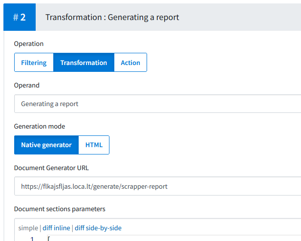

# myDecoCloud Document Assembler Template

**This is a skeleton project that provides a basic [TypeScript](https://www.typescriptlang.org) Node.js-based solution for generating PDF documents, implementing myDecoCloud DocumentAssembler API.**

You can either use it a starting point for your own project, or just get inspiration from it and check how our reference implementation works.

If you want to use this project as a starting point, fork it and feel free to modify it as you wish.
We wanted to provide a simple bootstrap project with very minimal setup and configuration, so do not hesitate to fine tune it to your needs if you are confortable with JavaScript development (ex. add a [linter](https://typescript-eslint.io), switch to [yarn](https://yarnpkg.com), etc).

We also set up TypeScript in strict mode, if you are not comfortable with it, you can make the type checker much more lenient by changing the `tsconfig.json` according to your preferences. You can even use plain JS!

**Do not hesitate reach out to our team if:**
 - You need help or guidance,
 - Report unclear instructions or unexpected problems/bugs in the **provided** code.

## Requirements

 - On Windows we'd recommend to use [Windows Terminal](https://apps.microsoft.com/detail/windows-terminal/9N0DX20HK701) instead of the classic `cmd` command shell.
 - [Node.js & npm](https://nodejs.org) (see `package.json#engines` for exact version requirements).
 - Optional: [Volta.sh](https://volta.sh) for automatically install the required Node & npm versions, scoped to this project.
 - Recommended editor:
   - [WebStorm IDE](https://www.jetbrains.com/webstorm) (commercial),
     recommended additional plugins:
     [.ignore](https://plugins.jetbrains.com/plugin/7495),
     [.env files support](https://plugins.jetbrains.com/plugin/9525),
     [GraphQL](https://plugins.jetbrains.com/plugin/8097).
   - [Visual Studio Code](https://code.visualstudio.com) (free),
     go to Extensions panel and install workspace-recommended extensions (see `.vscode/extensions.json`).

## Development

### Just getting started

Once you have all required software...

1. **Copy (not rename) `.env.defaults` to a new file named `.env`**

   Both files contain environment variables you can set to configure the project.

    - `.env.defaults` contains default values and is committed to the repository.
    - `.env` is gitignored and is meant to set you machine-specific preferences, overriding defaults.

   Ex. you can set `DOCUMENTASSEMBLER_PORT=3000` in your `.env` to run the server on port 3000 instead of the default 8080.

2. **Install dependencies**

   Open a terminal in the project directory and run:

   ```sh
   npm i # shortcut for "npm install"
   ```
   The postinstall script in `package.json` will also build the project after dependencies are installed.

3. **Run server**

   You can try to run your freshly compiled server with `npm run serve`, if that works you're good to go, check out the next sections to generate your first document.

### Useful commands

 - `npm run build`: Build the project once.
 - `npm run watch`: Build the project and recompile on file change.
 - `npm run serve`: Run the compiled project and restart the process on file change.
 - `npm run tunnel -- --port 8080`: Expose the local server to the internet using [localtunnel](https://localtunnel.me).
   Use the temporary domain provided by localtunnel and use this in myDecoCloud's backoffice.
 - `npm run dev`: Run both `watch`, `serve` and `tunnel` in parallel.

### Typical development workflow example

These are steps for a **recommended development workflow**:

1. **Determine what your local server URL will be**
   - If you have a public static IP with a port open directly to your machine from the outside, you can use that IP and port in myDecoCloud's backoffice configuration for testing.
   - If you don't have that (ie. you're behind a NAT you can't configure), you can use a public service like [localtunnel](https://localtunnel.me) or [ngrok](https://ngrok.com) to make your machine available on the Internet.

     Run the command `npm run tunnel -- --port 8080` and use the URL it prints out in myDecoCloud's backoffice configuration.

     With the free version of both localtunnel and ngrok, you'll get a new random domain every time you run the command, so you'll have to update the configuration on myDecoCloud every time.
     You can obtain a permanent subdomain with a paid subscription.

2. **Compile project**

   Split or open a new terminal and run `npm run watch` to compile the project and recompile on file change.

3. **Run project**

   Split or open a new terminal again and run `npm run serve` to run the compiled project and restart the process on file change.

   > You can also execute `npm run dev` to run both `tunnel`, `watch` and `serve` in the same terminal, but keep in mind that it might render your terminal more difficult to read.
   >
   > Those shortcut commands are defined in package.json.
   >
   > Any of those commands can be terminated with `Ctrl+C`.

4. **Configure myDecoCloud Backoffice**

   In the Outputs section, change the "Document Generator URL" field value to the URL of your document generation endpoint on your server, for example: `https://flkajsfljas.loca.lt/generate/scrapper-report`.

   

5. **Generate a document**

   You can now generate a first document by going through the myDecoCloud tunnel.

   When generating this document, the server writes the request (from myDecoCloud server) body to a `logs/received-manifest.json` file.

   You can now easily generate the document again without going through the whole myDecoCloud tunnel again.
   For that, use an API testing software like [Postman](https://www.postman.com/), and send a POST request to the document generation endpoint of the server, with the content of the `logs/received-manifest.json` file as a JSON body.

   It will return many messages, and the last one should be a `document` message, with a `documentUrl` value.
   This is a path to add to your server host URL to access the generated PDF, for example: `https://flkajsfljas.loca.lt/files/1698151486293/scrapper-report-example.pdf`

## Production deployment

Update this section with your deployment instructions.

The basic process is to install npm dependencies and run `npm run run-server`.

Though we'd highly recommend to use at least a process manager like [pm2](https://pm2.keymetrics.io) to run the server in production:
 - Restarts the app if it crashes,
 - Install as a system service, so it starts automatically when the machine boots,
 - Persistent log files,
 - Run multiple instances of the app to take advantage of multiple CPU cores in case of heavy load and/or have redundancy,
 - And more.

Contact our team if you need guidance and help for your production deployment.
